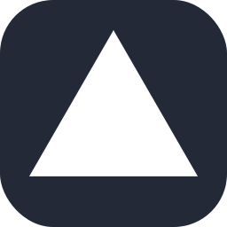

<h1>HI I'm Muhammad Usman Gill</h1>

<h2>Front-end Developer </h2>

<h3>About me:</h3>

<ul>
  <li>Doing Bachelor's in CS from NUML University (3.4/4 GPA) </li>
  <li>@<a href="https://www.linkedin.com/in/usman-gill26/">LinkedIn </a>Currently doing DSA and Web Development </li>
 <li>@<a href="https://leetcode.com/u/UsmanGill1/leetcode">Leetcode</a> Solved 80+ Data Structure and Algorithm problems in C++</li>
  <li>@lablab.ai: <a href= "https://lablab.ai/u/@UsmanGill">Participated</a> in multiple International AI Hackathons (upto 7)</li>
  <li>@WordPress: <a href= "https://www.linkedin.com/posts/usman-gill26_usman-activity-7192202974641721344-gShe?utm_source=share&utm_medium=member_desktop">Winner🥇 </a>of WordPress Hackathon</li>
  <li>@Harvard University(CS50x_PuzzleDay_Winner): Our Team won
    <a href= "https://www.linkedin.com/posts/usman-gill26_usman-activity-7184951712451813376-rpII?utm_source=share&utm_medium=member_desktop">1st Place</a> solving (9/9) complex puzzles 
  </li>
  <li>@<a href= "https://www.linkedin.com/posts/usman-gill26_monkeytype-monkeytype-productivity-activity-7227323955760562179-mCQB?utm_source=share&utm_medium=member_desktop">Typing Speed</a> Upto 60 WPM</li>
</ul>

<h3>My Skill Set:</h3>
<table>
  <tr>
            <td class="category-title"><h3>Frontend</h3></td>
            <td class="category-title"><h3>Languages</h3></td>
            <td class="category-title"><h3>Others</h3></td>
        </tr>
        <tr>
            <td>
                

                  
                  
                  
                  
                   
                  
                

            </td>
            <td>
                
  
                       
                       
                       
                       
                   
                       
                

            </td>
            <td>
                
  
                       
                       
                       
                       
                   
                       
                       
                        
                

            </td>
        </tr>
</table>
<h3>Contact with me:</h3>

  
  
  
  

<h2>Github stats:</h2>

  

  

 

  
  

